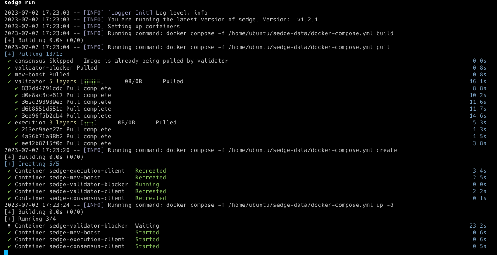

**[Portuguese below]**

# Ethereum Node on AWS EC2 with Terraform and Ansible

This project implements an Ethereum validator node on AWS EC2 using Terraform for infrastructure provisioning and Ansible for node configuration.

## Project Structure

```
ethereum-validator/
│
├── ansible/
│   ├── ansible.cfg
│   ├── hosts.ini
│   └── ethereum_validator.yml
│
├── terraform/
    ├── modules/
        ├── security_group/
            ├── main.tf
            ├── variables.tf
│   ├── main.tf
│   ├── variables.tf
│   ├── outputs.tf
│   └── locals.tf
│
├── .gitignore
├── README.md
└── LICENSE
```

## Requirements

- [Terraform](https://www.terraform.io/downloads.html) (version 0.13 or higher)
- [Ansible](https://docs.ansible.com/ansible/latest/installation_guide/intro_installation.html) (version 2.9 or higher)
- AWS account with properly configured credentials
- Existing SSH key pair in AWS and on your local system

## How to Use

1. Clone this repository:

   ```
   git clone https://github.com/ffelipesimoes/ethereum-validator.git
   cd ethereum-validator
   ```

2. Configure your AWS credentials using the AWS CLI:

   ```
   aws configure
   ```

3. Edit the `variable.tf` file and update the `public_key_path` value to the path of your public key.

4. Navigate to the `terraform/` directory and initialize Terraform:

   ```
   cd terraform/
   terraform init
   ```

5. Verify the Terraform execution plan and confirm that it is correct:

   ```
   terraform plan
   ```

6. Apply the Terraform configuration to create the infrastructure on AWS:

   ```
   terraform apply
   ```

7. After Terraform completes, navigate to the `ansible/` directory:

   ```
   cd ../ansible/
   ```

8. Update the `hosts.ini` file with the public IP of the EC2 instance created by Terraform. You can find the IP in the `terraform/terraform.tfstate` file.

9. Execute the Ansible playbook to configure the Ethereum node:

   ```
   ansible-playbook -i hosts.ini install_ethereum_validator.yml
   ```

After the playbook runs successfully, your Ethereum node will be up and running in the Docker container on the AWS EC2 instance.

## Explanation

An Ethereum validator node using SEDGE and Teku refers to a configuration that utilizes the SEDGE software as a high-performance Ethereum client and Teku as an Ethereum 2.0 (Eth2) client for validation on the Beacon Chain network.

SEDGE: SEDGE is an Ethereum client implementation that has been developed with a focus on high performance and low resource consumption. It is optimized for block and transaction validation on the Ethereum network. SEDGE is designed to be highly scalable and efficient, enabling validators to perform their functions effectively.

Teku: Teku, on the other hand, is an Ethereum 2.0 client developed by ConsenSys. It is designed to support the Beacon Chain and the proof-of-stake consensus mechanism of Ethereum 2.0. Teku allows validators to participate in Ethereum 2.0 and perform validation tasks such as block proposing, voting, and participation in the consensus mechanism.

By combining SEDGE and Teku, validators can perform validation tasks on both the Ethereum 1.0 network and the Ethereum 2.0 network.

**[Inglês acima]**


# Ethereum Node em AWS EC2 com Terraform e Ansible

Este projeto implementa um nó ethereum validator na AWS EC2 usando Terraform para provisionar a infraestrutura e Ansible para configurar o nó.

## Estrutura do projeto

```
ethereum-validator/
│
├── ansible/│
│   ├── ansible.cfg
│   ├── hosts.ini
│   └── ethereum_validator.yml
│
├── terraform/
    ├── modules/
        ├── security_group/
            ├── main.tf
            ├── variables.tf
│   ├── main.tf
│   ├── variables.tf
│   ├── outputs.tf
│   └── locals.tf
│
├── .gitignore
├── README.md
└── LICENSE
```

## Requisitos

- [Terraform](https://www.terraform.io/downloads.html) (versão 0.13 ou superior)
- [Ansible](https://docs.ansible.com/ansible/latest/installation_guide/intro_installation.html) (versão 2.9 ou superior)
- [Conta AWS](https://aws.amazon.com/) com as credenciais configuradas corretamente
- Chave SSH existente na AWS e em seu sistema local

## Como usar

1. Clone este repositório:

   ```
   git clone https://github.com/ffelipesimoes/ethereum-validator.git
   cd ethereum-validator
   ```

2. Configure suas credenciais da AWS usando o AWS CLI:

   ```
   aws configure
   ```

3. Edite o arquivo `variable.tf` e atualize o path da sua chave pública dentro do bloco ` public_key_path` para o path da chave que você usa.

4. Navegue até o diretório `terraform/` e inicialize o Terraform:

   ```
   cd terraform/
   terraform init
   ```

5. Verifique o plano de execução do Terraform e confirme se está correto:

   ```
   terraform plan
   ```

6. Aplique as configurações do Terraform para criar a infraestrutura na AWS:

   ```
   terraform apply
   ```

7. Após a conclusão do Terraform, navegue até o diretório `ansible/`:

   ```
   cd ../ansible/
   ```

8. Atualize o arquivo `hosts.ini` com o IP público da instância EC2 criada pelo Terraform. Você pode encontrar o IP no arquivo `terraform/terraform.tfstate`.

9. Execute o playbook do Ansible para configurar o nó ethereum:

   ```
   ansible-playbook -i hosts.ini install_ethereum_validator.yml
   ```

Após a execução bem-sucedida do playbook, seu nó ethereum estará em funcionamento no contêiner na instância EC2 da AWS.

## Explicação

Um nó validador Ethereum usando SEDGE e Teku refere-se a uma configuração que utiliza o software SEDGE como um cliente Ethereum de alto desempenho e Teku como um cliente Ethereum 2.0 (Eth2) para validação na rede Beacon Chain.

SEDGE: SEDGE é uma implementação do cliente Ethereum que foi desenvolvida com foco em alto desempenho e baixo consumo de recursos. Ele é otimizado para a validação de blocos e transações na rede Ethereum. O SEDGE é projetado para ser altamente escalável e eficiente, permitindo que os validadores executem suas funções com eficiência.

Teku: Teku, por sua vez, é um cliente Ethereum 2.0 desenvolvido pela ConsenSys. Ele é projetado para suportar a Beacon Chain e o mecanismo de consenso de proof-of-stake do Ethereum 2.0. O Teku permite que os validadores participem do Ethereum 2.0 e realizem tarefas de validação, como proposição de blocos, votação e participação no mecanismo de consenso.

Ao combinar o SEDGE e o Teku, os validadores podem executar tarefas de validação tanto na rede Ethereum 1.0 quanto na rede Ethereum 2.0.
